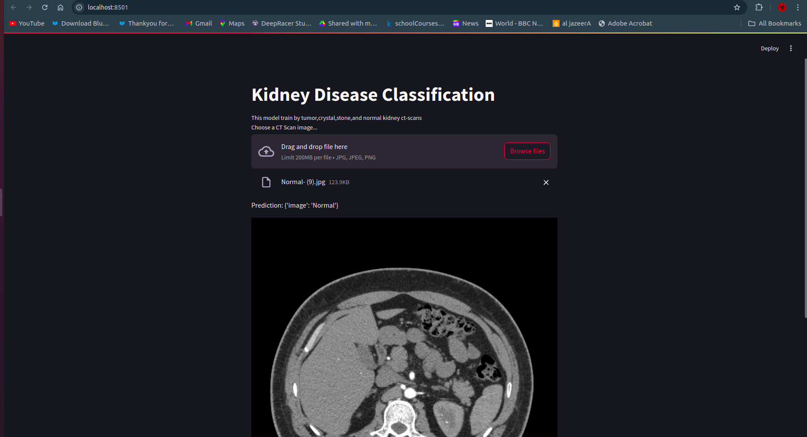
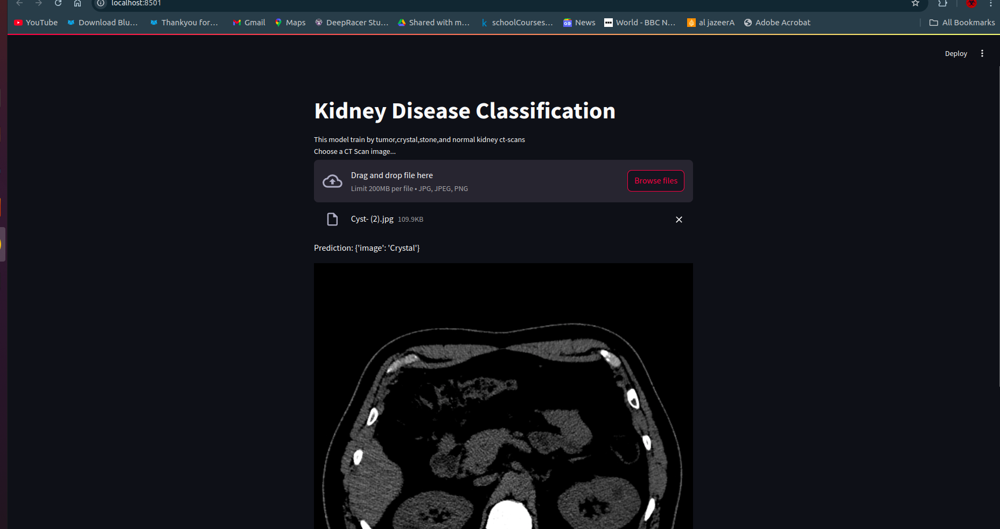
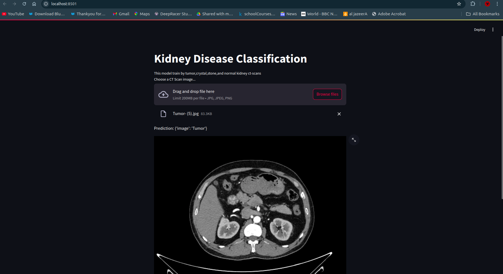
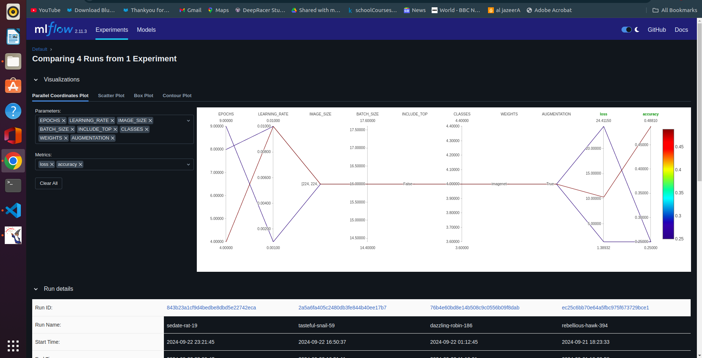

# Kidney Disease Classification Using VGG16 

## Project Overview
This project aims to classify kidney diseases (normal, tumor, stone, crystal) using CT scan images. The classification model is built using a pre-trained VGG16 network with transfer learning and fine-tuning.

The project integrates MLOps tools like MLflow for experiment tracking and DVC for data and model versioning to ensure reproducibility.

## Dataset
The dataset consists of CT scan images of kidneys, divided into four classes:
- Normal
- Tumor
- Stone
- Crystal

There are approximately 1,300 images in each class, stored in the following directory structure:

dataset/ ├── normal/ ├── tumor/ ├── stone/ └── crystal/

## Project Pipeline
The end-to-end pipeline includes the following steps:
1. **Data Ingestion**: Downloading and preparing the dataset.
2. **Data Preprocessing**: Data augmentation and splitting into train/validation/test sets.
3. **Model Preparation**: Using the VGG16 base model, adding custom layers, and compiling the model.
4. **Model Training**: Fine-tuning the model and training with Early Stopping.
5. **Model Evaluation**: Evaluating model performance on the test set.
6. **Deployment**: A simple Streamlit app for real-time predictions.

# Data 
[https://drive.google.com/file/d/1N2gRFetAGVl8Ub3G1tAcZ1jLI4VHYR6j/view?usp=drive_link]

Workflows 

- Update config.yaml
- Update secrets.yaml 
- Update params.yaml
- Update the entity
- Update the configuration manager in src config
- Update the components
- Update the pipeline
- Update the main.py
- Update the dvc.yaml
- app.py

## create a env 

> conda create -n kidney-scan python=3.8 -y

## activate env 

> conda activate kidney-scan

## install requirements.txt

> pip install requrirements.txt

## remove dvc lock file 

>dvc.lock

## for runing 

> streamlit run app.py

### connect github with Dagshub 

[Dagshub]https://dagshub.com/

## mlflow 

[Mlflow]https://dagshub.com/shameemmon.mk/kidney-disease-classification-using-mlflow--End-to-End-Project.mlflow/#/experiments/0?searchFilter=&orderByKey=attributes.start_time&orderByAsc=false&startTime=ALL&lifecycleFilter=Active&modelVersionFilter=All+Runs&datasetsFilter=W10%3D

## dvc comments
> dvc init 
> dvc repro

